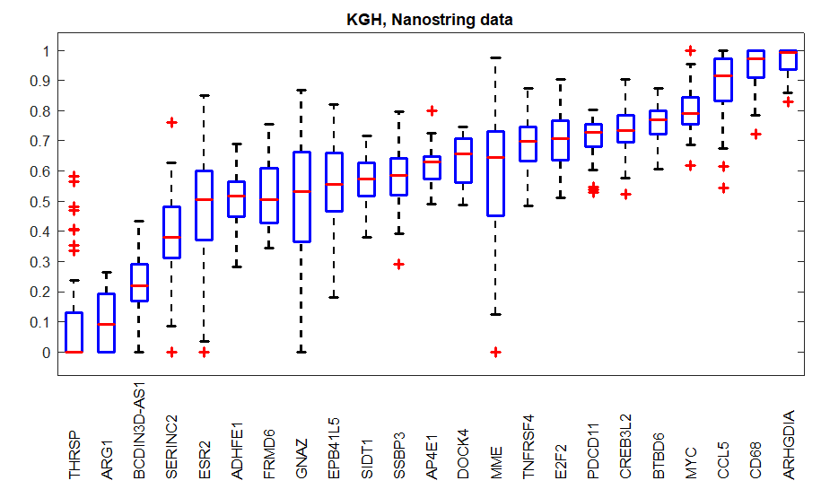

# TCF3 targets In DLBCL

<b>How to classify DLBCL cases into 2 subtypes based on the TCF3 target genes</b>

A) If you are using MATLAB, follow the script_runTCF3classifier.mlx life script

B) If you are NOT using MATLAB, you would need to re-build the classifier using our Nanostring dataset as follows
1. Train the classifier on the Nanostring KGH dataset

    a) load the Nanostring KGH data 
  
    b) log2 transform the data
  
    c) min-max standardize the log2 transformed data across samples. 
      As a result, each sample will have a 0 for the lowest expressing gene and 1 for the highest expressing gene.
  
    d) visualize the distribution of the selected genes across samples using box plots. It should look like this:  
    
    
    e) train k-NN classifier, use Spearman correlation as a similarity distance for the kNN with equal distance weights and number of neighbours criteria set at 3.
2. Prepare <b>your</b> dataset
  
    a) extract the 23 selected genes
    
    b) order the data by the selected genes in <b> the same order (!)</b> as they were used in the trained classifier (in step 1e).
    
    c) log 2 transform the extracted data (as in step 1b)
    
    d) min-max standardize the log 2 transformed data (as in step 1c)
    
    e) visualize the distribution of the selected genes using box plots and compare it to the distribution of the Nanostring genes (step 1d).
      The better the match to our Nanostring data, the more optimal the classification will be. <b> DO NOT </b> manipulate the data by adjusting median expression of individual genes. Instead look into changing your data preprocessing, including alignment, and normalization methods. 
    
    f) double check that the order of the genes in the two plots matches.
    
    g) apply the trained classifier from step 1e on your standardized data.
